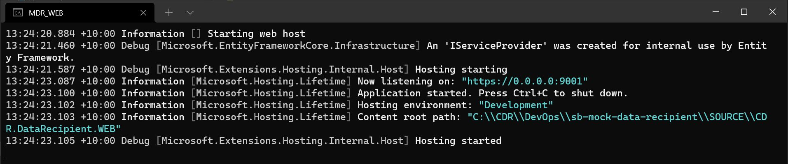
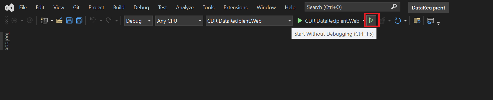
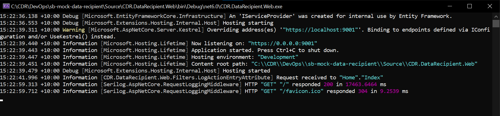
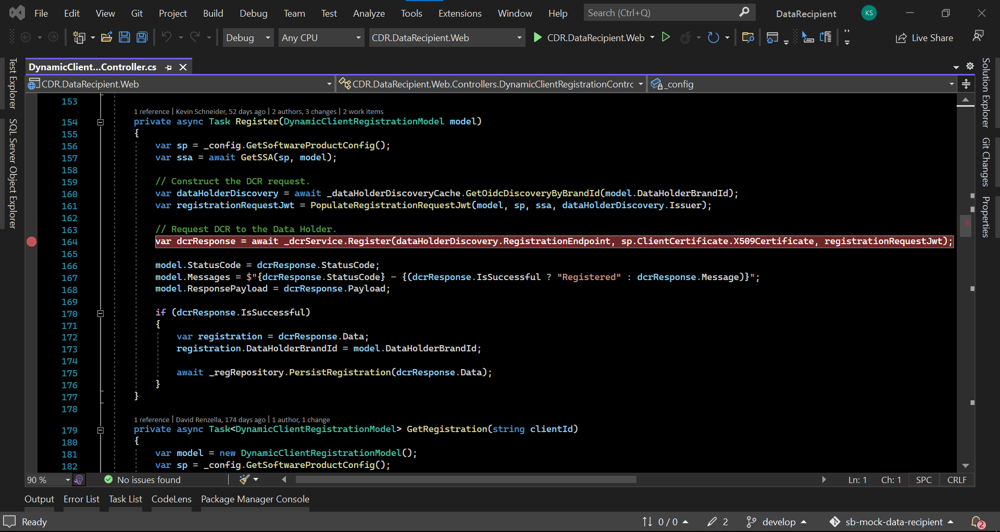
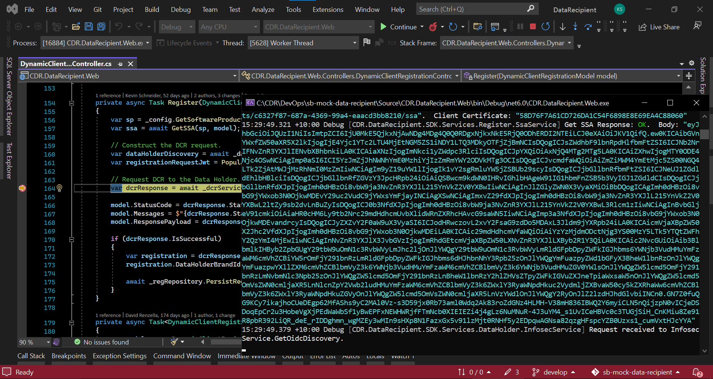
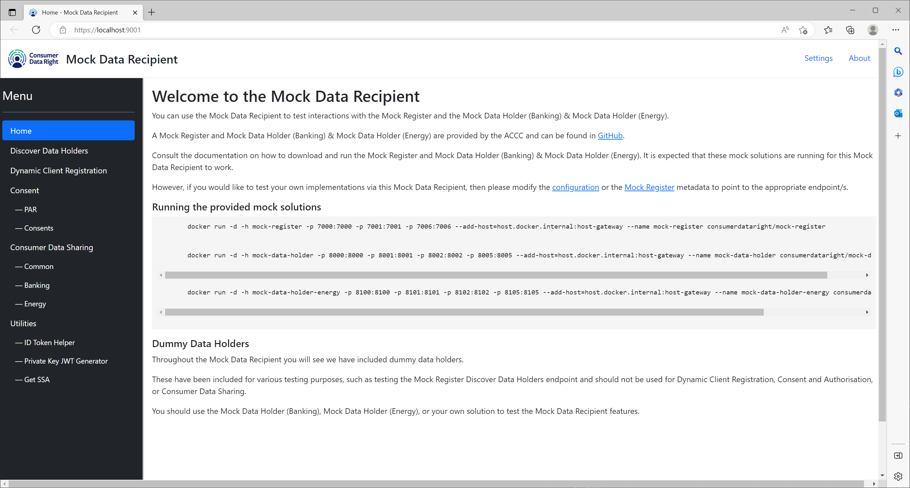

<h2>To get started, clone the source code</h2>

1. Create a folder called CDR 
2. Navigate to this folder 
3. Clone the repo as a subfolder of this folder using the following command; 

git clone https://github.com/ConsumerDataRight/mock-data-recipient.git 

4. Install the required certificates. See certificate details <a href="../../CertificateManagement/README.md" title="Certificate Management" alt="Certificate Management - CertificateManagement/README.md"> here</a>. 
5. Start the projects in the solution, can be done in multiple ways, examples below are from .Net command line and using MS Visual Studio 

<h2>.Net command line</h2>

1. Download and install the free <a href="https://docs.microsoft.com/en-us/windows/terminal/get-started" title="Download the free Windows Terminal here" alt="Download the free MS Windows Terminal here">MS Windows Terminal</a>
 
2. Use the <a href="../../Source/Start-Data-Recipient.bat" title="Use the Start-Data-Recipient .Net CLI batch file here" alt="Use the Start-Data-Recipient .Net CLI batch file here">Start-Data-Recipient</a> batch file to build and run the required projects to start the Mock Data Recipient,
 
this will create the LocalDB instance by default and seed the database with the supplied sample data.

LocalDB is installed as part of MS Visual Studio if using MS VSCode then adding the MS SQL extension includes the LocalDB Instance.

You can connect to the database from MS Visual Studio using the SQL Explorer, or from MS SQL Server Management Studio (SSMS) using
	the following settings;  
	Server type: Database Engine  
	Server name: (LocalDB)\MSSQLLocalDB  
	Authentication: Windows Authentication 

<h2>MS Visual Studio</h2>

To launch the application using MS Visual Studio,

1. Select the project to start.

2. Then start the project (Ctrl + F5 or F5 or Debug > Start Debugging).

An output window will be launched for the selected project started. 
This will show the logging messages as sent to the console of the running project.
 

<h3>Debugging the running project using MS Visual Studio can be performed as follows;</h3>

1. Select the project you want to debug and place the appropriate breakpoints as desired.

2. Start a new debug instance for the selected project (F5 or Debug > Start Debugging).

	A new output window for the debug project will be started.

 

The browser window will be started with the Mock Data Recipient solution.

