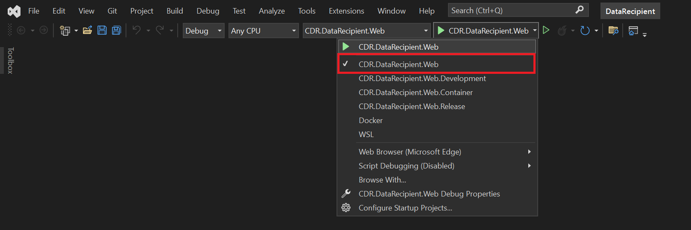
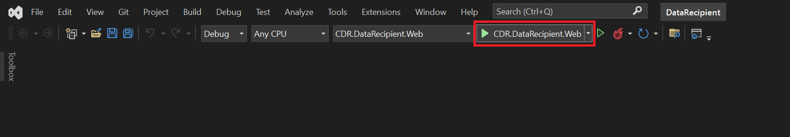

# Getting Started
To get started, clone the source code from the GitHub repositories by following the steps below:

1. Create a folder called CDR.
2. Navigate to this folder.
3. Clone the repo as a subfolder of this folder using the following command:
```
git clone https://github.com/ConsumerDataRight/mock-data-recipient.git
```
4. Install the required certificates. See certificate details [here](../../CertificateManagement/README.md "Certificate Management").  
5. Start the projects in the solution. This can be done in multiple ways. This guide explains how to do this using .Net command line and using MS Visual Studio.

## Run solution using .Net command line

1. Download and install the free [MS Windows Terminal](https://docs.microsoft.com/en-us/windows/terminal/get-started "Download the free Windows Terminal here").  
2. Use the [Start-Data-Recipient](../../Source/Start-Data-Recipient.bat "Use the Start-Data-Recipient .Net CLI batch file here") batch file to build and run the required projects to start the Mock Data Recipient.

[](./images/DotNet-CLI-Running.png)

The browser window will be started with the Mock Data Recipient solution.

[](./images/Launch-application-in-browser.png)

This will create the LocalDB instance by default and seed the database with the supplied sample data.

LocalDB is installed as part of MS Visual Studio. If using MS VSCode, the MS SQL extension will need to be installed.

You can connect to the database from MS Visual Studio using the SQL Explorer, or from MS SQL Server Management Studio (SSMS) using the following settings:
```
Server type: Database Engine  
Server name: (LocalDB)\\MSSQLLocalDB  
Authentication: Windows Authentication  
```


## Run solution using MS Visual Studio

### Start the Mock Data Recipient

The following steps outline describe how to launch the Mock Data Recipient solution using MS Visual Studio:

1. Open the Mock Data Recipient solution using MS Visual Studio.

2. Select the 'CDR.DataRecipient.WEB' project.

[](./images/MS-Visual-Studio-Select-Project.png)

2. Click "Start" to start the Mock Data Recipient solution.

[](./images/MS-Visual-Studio-Start.png)

An output window will be launched for the Mock Data Recipient showing the logging messages as sent to the console. E.g.

[](./images/MS-Visual-Studio-Running.png)

The browser window will be started with the Mock Data Recipient solution.

[](./images/Launch-application-in-browser.png)


### Debugging using MS Visual Studio

To run the Mock Data Recipient in debug mode, simply follow the steps outlined above and click on the "Start" button as shown in the image below:

[](./images/MS-Visual-Studio-Start-Debug.png)
